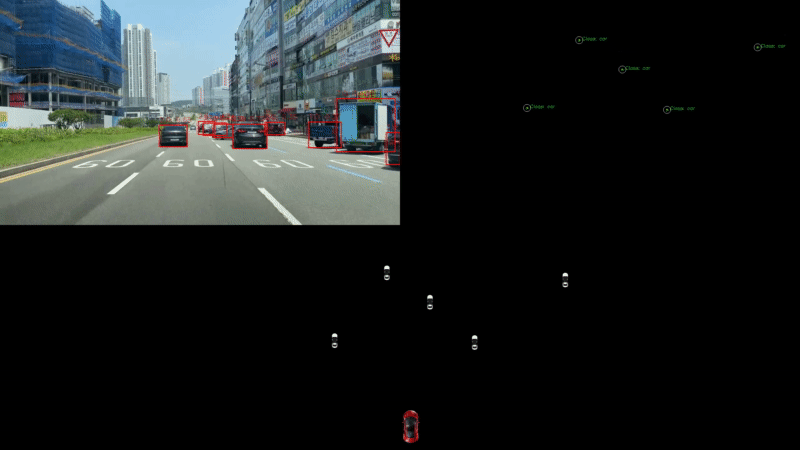

## YOLO Object Detection for Simple Bird's Eye View and Tracking

This project utilizes the YOLO deep learning model to perform real-time object detection for Advanced Driver Assistance Systems (ADAS). It provides a framework for detecting and tracking objects in the context of automotive safety and driver assistance applications. it provides a Bird's Eye View (BEV) visualization, which offers a top-down perspective of the detected objects.



### Features

- Real-time object detection using the YOLO model.
- Detection of various objects relevant to ADAS, such as vehicles, pedestrians, cyclists, and traffic signs.
- Object tracking to maintain continuity and trajectory of detected objects.
- Bird's Eye View (BEV) visualization of the detected objects in a simulated environment.
- Customizable confidence threshold and class filtering.
- Simulated environment provides an intuitive top-down view of object positions and movements.
- Supports both image and video input for object detection and tracking.
- Easy integration with pre-trained YOLO models.
- Provides bounding box coordinates, class labels, and tracking IDs for detected objects.

### Prerequisites

- Python 3.x
- OpenCV
- PyTorch
- NumPy
- Ultralytics

### Installation

1. Clone this repository.
2. Install the required dependencies

```bash
pip3 install ultralytics opencv
```

### Usage

1. Download pre-trained YOLO weights or train your own model.
2. Provide the path to the YOLO weights in the code.
3. Run the script with the video file.
4. View the object detection results and Bird's Eye View visualization.
5. supports yolov5 , yolov7, yolov8, yolo11 detecton models

For more detailed usage instructions and options, refer to the project documentation.

### Run

```bash
python3 yolo_sim.py
```

### Contributing

Contributions are welcome! If you find any issues or have suggestions for improvements, please open an issue or submit a pull request.

### License

This project is licensed under the MIT License. See the `LICENSE` file for details.

### Acknowledgments

- YOLO: [https://github.com/ultralytics/yolov5](https://github.com/ultralytics/yolov5)
- OpenCV: [https://opencv.org/](https://opencv.org/)
